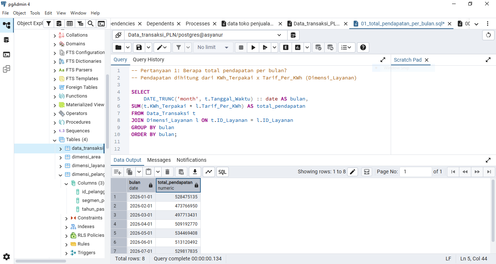
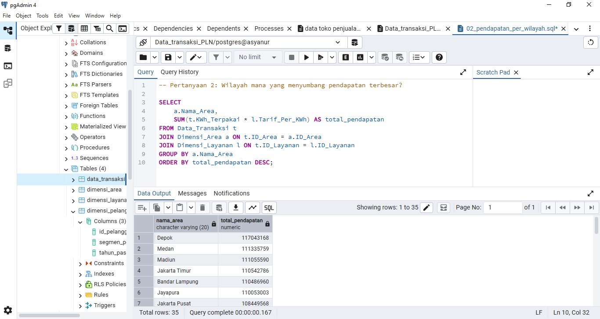
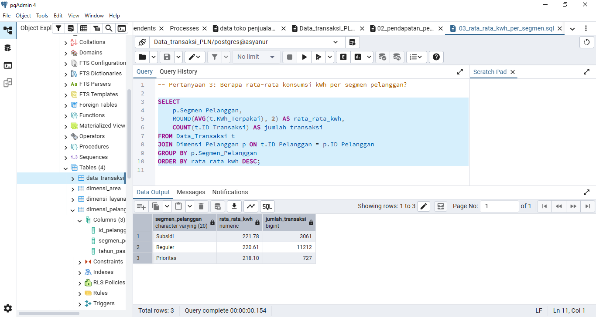
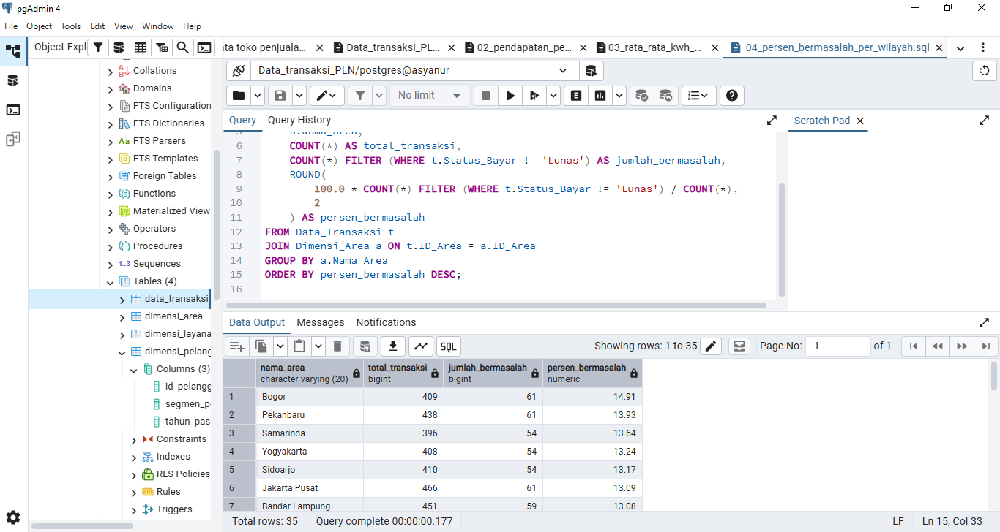
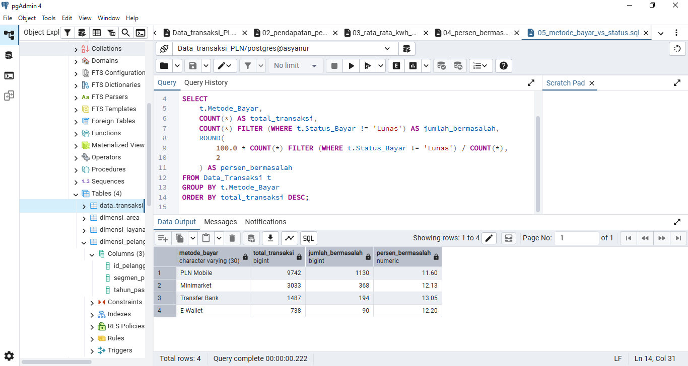
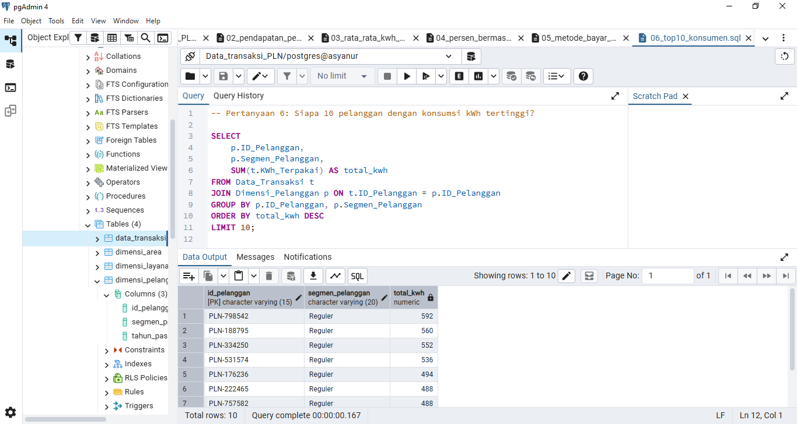
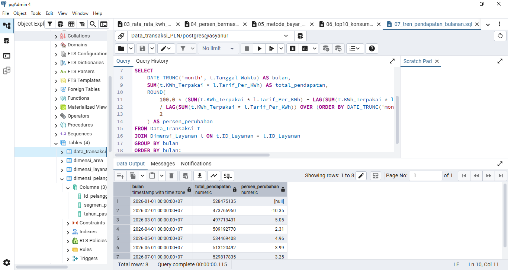
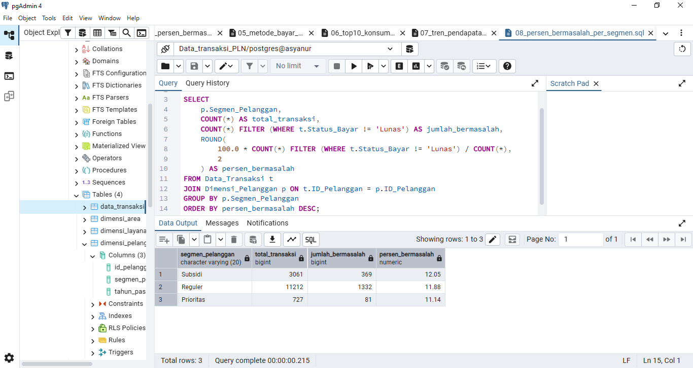

Analisis Pola Pembayaran & Konsumsi Listrik Pelanggan PLN

Proyek analisis data menggunakan SQL (PostgreSQL) untuk mengidentifikasi pola konsumsi listrik, tren pendapatan, dan risiko tunggakan pembayaran pelanggan PLN, berdasarkan data transaksi multi-tabel (star schema).

Latar Belakang & Tujuan

Sebagai simulasi peran data analyst, proyek ini menjawab kebutuhan bisnis: **PLN ingin memahami pola pembayaran dan konsumsi pelanggannya** untuk mengidentifikasi wilayah dan segmen pelanggan yang berisiko tinggi menunggak, serta memahami tren pendapatan dari waktu ke waktu.

Tools yang Digunakan

- PostgreSQL — database engine
- pgAdmin 4 — GUI untuk mengelola database dan menjalankan query
- Microsoft Excel — pembersihan awal data sebelum import

Struktur Data (Star Schema)

Dataset terdiri dari 1 tabel fakta dan 3 tabel dimensi:

```
Data_Transaksi (fakta)
├── ID_Transaksi (PK)
├── Tanggal_Waktu
├── ID_Pelanggan (FK) ──→ Dimensi_Pelanggan
├── ID_Layanan (FK)   ──→ Dimensi_Layanan
├── ID_Area (FK)      ──→ Dimensi_Area
├── KWh_Terpakai
├── Status_Bayar
└── Metode_Bayar

Dimensi_Pelanggan          Dimensi_Layanan            Dimensi_Area
├── ID_Pelanggan (PK)      ├── ID_Layanan (PK)        ├── ID_Area (PK)
├── Segmen_Pelanggan       ├── Kategori_Layanan       ├── Nama_Area
└── Tahun_Pasang           ├── Nama_Layanan           ├── Provinsi
                           └── Tarif_Per_KWh           ├── Latitude
                                                        └── Longitude
```

Pertanyaan Bisnis, Query, & Insight

1. Berapa total pendapatan per bulan?
`queries/01_total_pendapatan_per_bulan.sql`



Insight: Tren pendapatan relatif stabil Maret–Juli 2026 dengan fluktuasi wajar (±5%). Data Agustus 2026 tidak lengkap satu bulan penuh, sehingga penurunan tajam di bulan tersebut **tidak mencerminkan kondisi bisnis riil** dan dikecualikan dari kesimpulan tren.

2. Wilayah mana yang menyumbang pendapatan terbesar?
`queries/02_pendapatan_per_wilayah.sql`



Insight: Distribusi pendapatan antar wilayah cukup merata — selisih antara wilayah tertinggi (Madiun) dan terendah (Manado) hanya sekitar 15%, menunjukkan basis pelanggan yang tersebar rata secara geografis.

3. Berapa rata-rata konsumsi kWh per segmen pelanggan?
`queries/03_rata_rata_kwh_per_segmen.sql`



Insight: Rata-rata konsumsi kWh antar segmen pelanggan (Reguler, Subsidi, Prioritas) hampir seragam, hanya berbeda 1–2%.

4. Berapa persentase transaksi bermasalah (telat/nunggak) per wilayah?
`queries/04_persen_bermasalah_per_wilayah.sql`



Insight: Bogor punya tingkat transaksi bermasalah tertinggi (14.91%), sementara Banjarmasin terendah (8.79%) — rentang variasi ini menjadikan wilayah sebagai indikator risiko tunggakan yang lebih kuat dibanding segmen pelanggan.

5. Metode pembayaran apa yang paling sering dipakai, dan apakah berkorelasi dengan status bayar?
`queries/05_metode_bayar_vs_status.sql`



Insight: PLN Mobile adalah metode pembayaran paling dominan (±63% dari seluruh transaksi), namun tingkat keberhasilan bayar antar metode pembayaran relatif mirip (11.6%–13%) — metode pembayaran bukan faktor kuat penentu ketepatan bayar.

6. Siapa 10 pelanggan dengan konsumsi kWh tertinggi?
`queries/06_top10_konsumen.sql`



Insight: Seluruh 10 pelanggan dengan konsumsi kWh tertinggi berasal dari segmen Reguler, bukan Prioritas — indikasi menarik bahwa sebagian pelanggan Reguler memiliki pola konsumsi menyerupai pelanggan bisnis/industri.

7. Bagaimana tren pendapatan dari bulan ke bulan?
`queries/07_tren_pendapatan_bulanan.sql`



Insight: Di luar Agustus (data tidak lengkap), pendapatan Maret–Juli berfluktuasi wajar di kisaran ±5% dari bulan sebelumnya, tanpa tren penurunan yang mengkhawatirkan.

8. Segmen pelanggan mana yang paling banyak menunggak?
`queries/08_persen_bermasalah_per_segmen.sql`



Insight: Segmen pelanggan bukan indikator kuat risiko tunggakan — ketiga segmen (Subsidi, Reguler, Prioritas) punya tingkat bermasalah yang hampir seragam (11%–12%).

Rekomendasi Bisnis

1. Prioritaskan program reminder/intervensi pembayaran di 5 wilayah dengan tingkat bermasalah tertinggi: Bogor, Pekanbaru, Samarinda, Yogyakarta, dan Sidoarjo.
2. Tinjau ulang klasifikasi segmen untuk pelanggan Reguler dengan konsumsi kWh tinggi — berpotensi lebih sesuai dipindahkan ke segmen Prioritas.
3. Karena metode pembayaran tidak signifikan mempengaruhi ketepatan bayar, strategi intervensi risiko tunggakan sebaiknya difokuskan berdasarkan wilayah, bukan metode pembayaran.

Skill SQL yang Didemonstrasikan

- Perancangan skema database (star schema) dengan `PRIMARY KEY` & `FOREIGN KEY`
- `JOIN` multi-tabel (hingga 3 tabel sekaligus)
- Agregasi (`SUM`, `AVG`, `COUNT`) dengan `GROUP BY`
- Conditional aggregation dengan `COUNT(*) FILTER (WHERE ...)`
- Window function (`LAG() OVER`) untuk menghitung tren perubahan bulanan
- Data cleaning & transformasi (penanganan koordinat gabungan, encoding CSV, foreign key constraint)

Struktur Repo

```
├── README.md
├── queries/
│   ├── 01_total_pendapatan_per_bulan.sql
│   ├── 02_pendapatan_per_wilayah.sql
│   ├── 03_rata_rata_kwh_per_segmen.sql
│   ├── 04_persen_bermasalah_per_wilayah.sql
│   ├── 05_metode_bayar_vs_status.sql
│   ├── 06_top10_konsumen.sql
│   ├── 07_tren_pendapatan_bulanan.sql
│   └── 08_persen_bermasalah_per_segmen.sql
└── screenshots/
    ├── 01_total_pendapatan_per_bulan.PNG
    ├── 02_pendapatan_per_wilayah.PNG
    ├── 03_rata_rata_kwh_per_segmen.PNG
    ├── 04_persen_bermasalah_per_wilayah.PNG
    ├── 05_metode_bayar_vs_status.PNG
    ├── 06_top10_konsumen.PNG
    ├── 07_tren_pendapatan_bulanan.PNG
    └── 08_persen_bermasalah_per_segmen.PNG
```

Cara Menjalankan Ulang

1. Buat database baru di PostgreSQL
2. Jalankan `CREATE TABLE` untuk keempat tabel (dimensi dulu, baru tabel fakta)
3. Import data dari masing-masing file CSV sesuai urutan: `Dimensi_Pelanggan`, `Dimensi_Layanan`, `Dimensi_Area`, lalu `Data_Transaksi`
4. Jalankan query di folder `queries/` untuk mereproduksi hasil analisis
